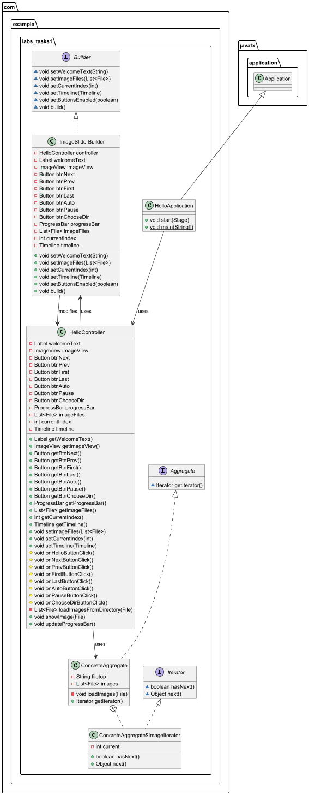

# Проект [IteratorAndBuilder]: Слайдер изображений

## Описание

Это приложение на JavaFX представляет собой слайдер изображений, который позволяет просматривать изображения из выбранной директории. Приложение реализует паттерны проектирования **"Iterator"** и **"Builder"** для последовательного доступа к изображениям и настройки пользовательского интерфейса.

---

## Требования

- **Java 11 или выше**
- **JavaFX SDK**

---

## Основные классы приложения

### Интерфейсы

- **`Aggregate`**: Интерфейс, определяющий метод для получения итератора.
- **`Iterator`**: Интерфейс, определяющий методы для работы с итератором.
- **`Builder`**: Интерфейс, определяющий методы для настройки пользовательского интерфейса и состояния слайдера.

### Реализации

- **`ConcreteAggregate`**: Класс, реализующий интерфейс `Aggregate`. Он загружает изображения из указанной директории и предоставляет итератор для доступа к ним.
- **`ImageIterator`**: Внутренний класс в `ConcreteAggregate`, реализующий интерфейс `Iterator`. Он позволяет последовательно перебирать изображения.
- **`ImageSliderBuilder`**: Класс, реализующий интерфейс `Builder`. Он отвечает за настройку пользовательского интерфейса и состояния слайдера.

### Основное приложение

- **`HelloApplication`**: Основной класс приложения, который запускает JavaFX и настраивает окно приложения.
- **`HelloController`**: Класс управления, который обрабатывает события пользовательского интерфейса и управляет логикой слайдера.

---

### Рабочее окно

- **`ImageView`**: Отображает текущее изображение.
- **Кнопки управления**:
  - **`btnFirst`**: Переход к первому изображению.
  - **`btnPrev`**: Переход к предыдущему изображению.
  - **`btnAuto`**: Автоматическая прокрутка изображений.
  - **`btnPause`**: Приостановка автоматической прокрутки.
  - **`btnNext`**: Переход к следующему изображению.
  - **`btnLast`**: Переход к последнему изображению.
  - **`btnChooseDir`**: Выбор директории с изображениями.
- **`ProgressBar`**: Отображает прогресс просмотра изображений.

---

## Установка и запуск

1. **Клонируйте репозиторий**:
   ```bash
   git clone https://github.com/SirBrusEd2/IteratorAndBuilder.git
# Руководство по запуску и использованию проекта

## Откройте проект в IDE

Используйте IntelliJ IDEA, Eclipse или другую среду разработки, поддерживающую JavaFX.

---

## Настройте JavaFX SDK

1. **Убедитесь, что JavaFX SDK добавлен в ваш проект.**
2. **Если вы используете IntelliJ IDEA, добавьте JavaFX SDK в качестве библиотеки.**

---

## Запустите приложение

1. **Запустите класс `HelloApplication`.**

---

## Пример использования

1. **Запустите приложение.**
2. **Нажмите кнопку "Выбрать папку", чтобы выбрать директорию с изображениями.**
3. **Используйте кнопки "Вперёд", "Назад", "В начало", "В конец" для навигации по изображениям.**
4. **Нажмите "Автопросмотр", чтобы включить автоматическую прокрутку изображений.**
5. **Нажмите "Пауза", чтобы приостановить автоматическую прокрутку.**
6. **Прогресс просмотра отображается в `ProgressBar`.**

---

## Паттерны проектирования

### Итератор

- **`Iterator`**: Используется для последовательного доступа к изображениям.
- **`ImageIterator`**: Реализует интерфейс `Iterator` и позволяет перебирать изображения в директории.

### Builder

- **`Builder`**: Используется для настройки пользовательского интерфейса и состояния слайдера.
- **`ImageSliderBuilder`**: Реализует интерфейс `Builder` и отвечает за настройку элементов интерфейса (кнопок, `ImageView`, `ProgressBar` и т.д.) и состояния слайдера.

---

## Скриншоты

Диаграмма классов:



Приложение:

---

## Приглашение к сотрудничеству

Мы приглашаем всех к участию в развитии проекта. Вот несколько идей для улучшения:

- Добавление новых функций для управления слайдером.
- Улучшение интерфейса пользователя.
- Реализация сохранения текущего состояния слайдера.

Если вы хотите внести свой вклад, создайте pull request или свяжитесь с нами через систему отслеживания проблем.

---

## Информация о лицензии

Этот проект распространяется под лицензией MIT. Подробности смотрите в файле `LICENSE`.

---

## Проекты, которые вас вдохновили

- [JavaFX Documentation](https://openjfx.io/)
- [Design Patterns: Elements of Reusable Object-Oriented Software](https://www.amazon.com/Design-Patterns-Elements-Reusable-Object-Oriented/dp/0201633612)

---

## Связанные проекты

- [JavaFX Examples](https://github.com/openjfx/samples)
- [Decorator Pattern in Java](https://refactoring.guru/design-patterns/decorator)